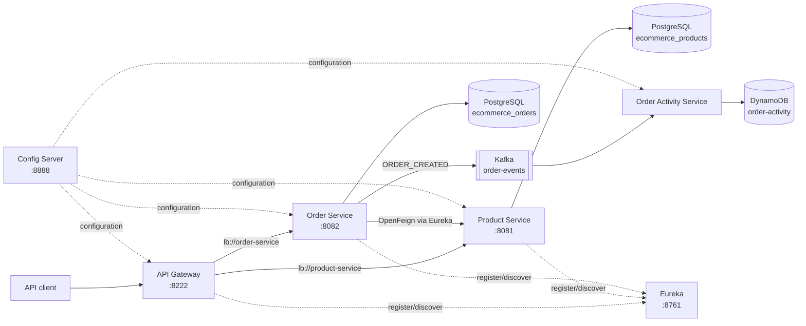

# E-commerce Microservices

This repository implements a small e-commerce backend with Spring Boot microservices. It keeps service discovery, centralized configuration, synchronous service-to-service calls, relational persistence, and asynchronous activity storage separate.

## Architecture



`order-activity-service` is a non-web Kafka consumer. It does not register with Eureka because no service calls are routed to it.

## Services

| Service | Responsibility | Port |
| --- | --- | ---: |
| `config-server` | Serves the native configuration profiles from `config-server/config-repo`. | 8888 |
| `discovery-server` | Provides Eureka registration and discovery. | 8761 |
| `api-gateway` | Routes product and order API requests through Eureka-backed `lb://` URIs. | 8222 |
| `product-service` | Creates and reads products stored in PostgreSQL. | 8081 |
| `order-service` | Validates product availability through OpenFeign, creates orders, and publishes `ORDER_CREATED`. | 8082 |
| `order-activity-service` | Consumes `ORDER_CREATED` events and writes the activity record to DynamoDB. | none |

## Technology

- Java 17 and Spring Boot
- Spring Cloud Config, Eureka, Gateway, OpenFeign, and LoadBalancer
- PostgreSQL and Flyway
- Kafka
- DynamoDB Local and AWS SDK for Java
- Maven Wrapper

## Local startup

### Prerequisites

- Java 17 or newer
- Docker with Docker Compose

Run commands from the repository root unless a command says otherwise.

### 1. Start data and messaging infrastructure

```bash
docker compose -f product-service/docker-compose.yml up -d
docker compose -f order-service/docker-compose.yml up -d
docker compose -f infrastructure/kafka/docker-compose.yml up -d
docker compose -f infrastructure/dynamodb/docker-compose.yml up -d dynamodb-local
```

The expected local container names are `product-db`, `order-db`, `kafka`, and `dynamodb-local-ecommerce`.

### 2. Create the DynamoDB table once

```bash
docker compose -f infrastructure/dynamodb/docker-compose.yml run --rm aws-cli \
  dynamodb create-table \
  --table-name order-activity \
  --attribute-definitions \
    AttributeName=orderId,AttributeType=S \
    AttributeName=eventKey,AttributeType=S \
  --key-schema \
    AttributeName=orderId,KeyType=HASH \
    AttributeName=eventKey,KeyType=RANGE \
  --billing-mode PAY_PER_REQUEST \
  --endpoint-url http://dynamodb-local:8000
```

If the table already exists, skip this step.

### 3. Build the repository

```bash
for module in \
  discovery-server \
  config-server \
  api-gateway \
  product-service \
  order-service \
  order-activity-service
do
  (cd "$module" && ./mvnw clean verify)
done
```

### 4. Start the applications in order

Open a separate terminal for each command and keep the repository root as the working directory:

```bash
java -jar config-server/target/config-server-0.0.1-SNAPSHOT.jar
```

```bash
java -jar discovery-server/target/discovery-server-0.0.1-SNAPSHOT.jar
```

```bash
java -jar product-service/target/product-service-0.0.1-SNAPSHOT.jar
```

```bash
java -jar order-activity-service/target/order-activity-service-0.0.1-SNAPSHOT.jar
```

```bash
java -jar order-service/target/order-service-0.0.1-SNAPSHOT.jar
```

```bash
java -jar api-gateway/target/api-gateway-0.0.1-SNAPSHOT.jar
```

Wait for `PRODUCT-SERVICE`, `ORDER-SERVICE`, and `API-GATEWAY` to appear as `UP` at <http://localhost:8761> before using the gateway. A newly started gateway may need one Eureka refresh interval before its first routed request succeeds.

## API examples

All public calls use the API Gateway at `http://localhost:8222`.

### Create a product

```bash
curl -i -X POST http://localhost:8222/api/v1/products \
  -H 'Content-Type: application/json' \
  --data '{
    "sku": "SKU-1000",
    "sellerId": "11111111-1111-1111-1111-111111111111",
    "name": "Wireless Headphones",
    "category": "ELECTRONICS",
    "price": 149.99,
    "availableFrom": "2026-09-16",
    "availableUntil": "2027-09-16"
  }'
```

Copy the returned product `id` for the next calls.

### Read products

```bash
curl -i http://localhost:8222/api/v1/products
curl -i http://localhost:8222/api/v1/products/PRODUCT_ID
```

### Create an order

```bash
curl -i -X POST http://localhost:8222/api/v1/orders \
  -H 'Content-Type: application/json' \
  --data '{
    "productId": "PRODUCT_ID",
    "customerId": "22222222-2222-2222-2222-222222222222",
    "orderNotes": "Leave at the front desk"
  }'
```

The order service accepts only `productId`, `customerId`, and `orderNotes`. It obtains `totalAmount` from the product and creates the order with status `PLACED` only when the product status is `AVAILABLE`.

### Read orders

```bash
curl -i http://localhost:8222/api/v1/orders
curl -i http://localhost:8222/api/v1/orders/ORDER_ID
```

## Kafka flow

1. `order-service` creates an order in PostgreSQL.
2. It publishes an `OrderCreatedEvent` to `order-events` with key `orderId`.
3. The event contains `eventId`, `eventType`, `orderId`, `productId`, `customerId`, `totalAmount`, and `occurredAt`.
4. `order-activity-service`, using consumer group `order-activity-service`, deserializes the event as `com.ecommerce.orderactivity.event.OrderCreatedEvent`.

Inspect consumer progress with:

```bash
docker exec kafka /opt/kafka/bin/kafka-consumer-groups.sh \
  --bootstrap-server localhost:9092 \
  --describe \
  --group order-activity-service
```

## DynamoDB activity flow

For every consumed event, `order-activity-service` writes one item to `order-activity`:

- Partition key: `orderId`
- Sort key: `eventKey`
- `eventKey` format: `occurredAt#eventId`
- Stored event fields: `eventId`, `eventType`, `productId`, `customerId`, `totalAmount`, and `occurredAt`

Inspect local activity records with:

```bash
docker compose -f infrastructure/dynamodb/docker-compose.yml run --rm aws-cli \
  dynamodb scan \
  --table-name order-activity \
  --endpoint-url http://dynamodb-local:8000
```

## Smoke test

Use the [end-to-end smoke test checklist](docs/smoke-test-checklist.md) after configuration or infrastructure changes.

